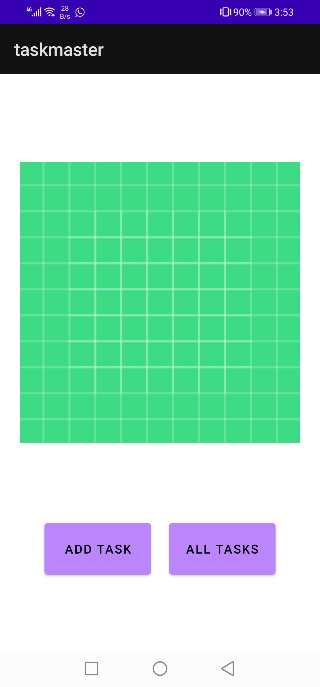
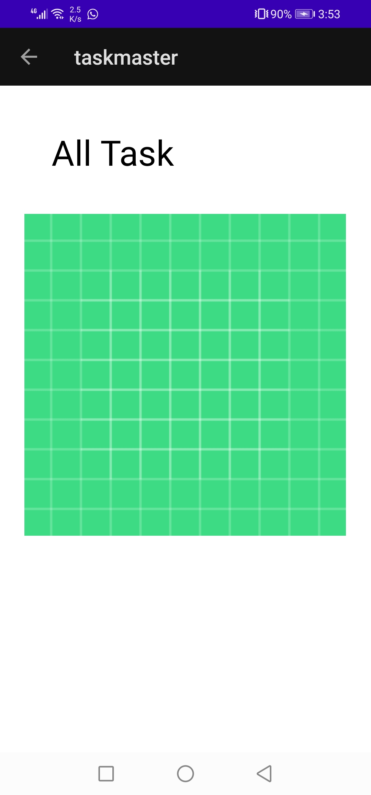
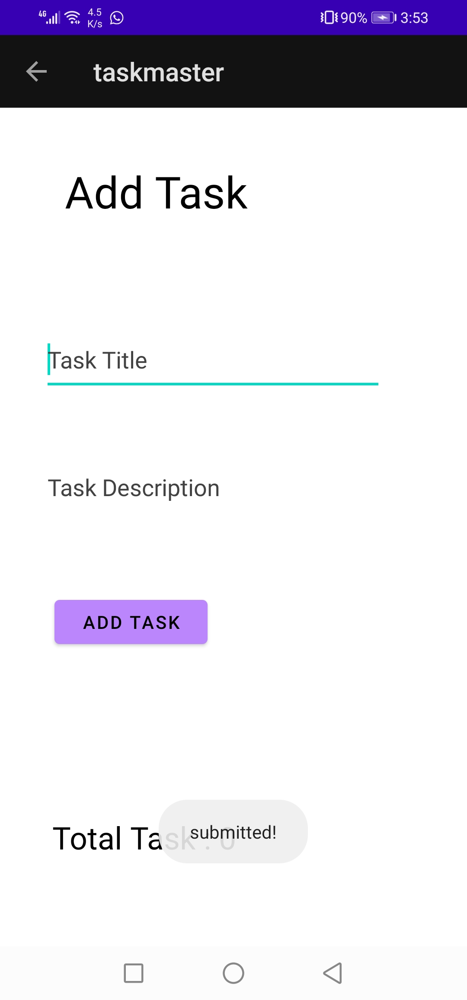
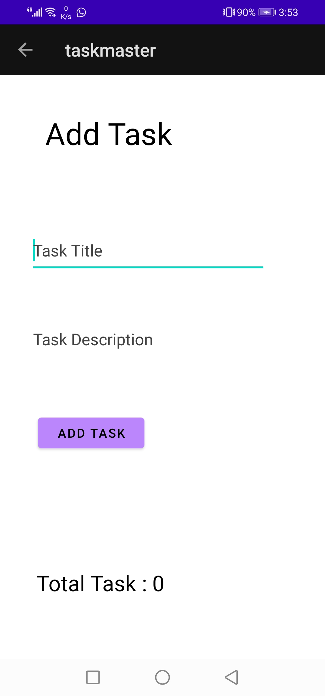

# Beginning TaskMaster (Lab 26)

add Feature Tasks :

1. Homepage : create image to mock the “my tasks” view, and buttons at the bottom of the page to allow going to the “add tasks” and “all tasks” page.

2. Add a Task : allow users to type in details about a new task, specifically a title and a body. When users click the “submit” button, show a “submitted!” label on the page.

3. All Task : Create page and add image with a back button

