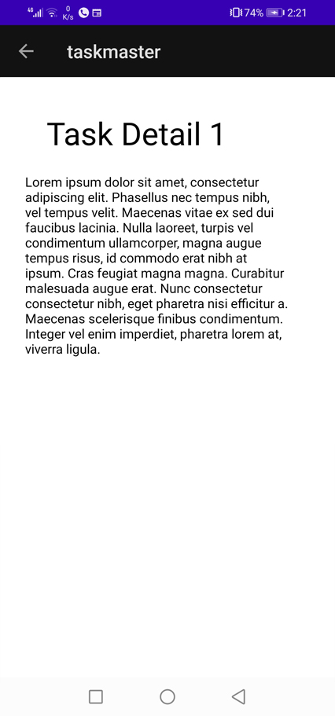

# Beginning TaskMaster (Lab 26)

Features added in this lab :

1. Homepage : create image to mock the “my tasks” view, and buttons at the bottom of the page to allow going to the “add tasks” and “all tasks” page.

2. Add a Task : allow users to type in details about a new task, specifically a title and a body. When users click the “submit” button, show a “submitted!” label on the page.

3. All Task : Create page and add image with a back button

# Data in TaskMaster (Lab 27)

Features added in this lab :

1. Task Detail Page : Create a Task Detail page. It should have a title at the top of the page 

2. Settings Page : Create a Settings page. It should allow users to enter their username and hit save

3. Homepage : add new three different buttons and when a user taps one of the titles, it should go to the Task Detail page, and the title at the top of the page should match the task title that was tapped on the previous page.

# RecyclerView (Lab 28)

Features added in this lab :

1. Task Model : Create a Task class. A Task should have a title, a body, and a state. The state should be one of “new”, “assigned”, “in progress”, or “complete”.

2. Homepage : 

* Refactor your homepage to use a RecyclerView for displaying Task data. This should have hardcoded Task data for now and Create a ViewAdapter class that displays data from a list of Tasks.

* Ensure that you can tap on any one of the Tasks in the RecyclerView, and it will appropriately launch the detail page with the correct Task title displayed.

# Room (Lab 29)

Features added in this lab :

1. Task Model and Room : set up Room in your application, and modify your Task class to be an Entity.
2. Add Task Form : Modify your Add Task form to save the data entered in as a Task in your local database.
3. Homepage : Refactor your homepage’s RecyclerView to display all Task entities in your database.
4. detail page : description and status of a tapped task are also displayed on the detail page

# Amplify and DynamoDB (Lab 32)

Features added in this lab :

Using the amplify add api command, create a Task resource that replicates our existing Task schema. Update all references to the Task data to instead use AWS Amplify to access your data in DynamoDB.

1. Modify the Add Task form to save the data entered in as a Task to DynamoDB.
2. Refactor your homepage’s RecyclerView to display all Task entities in DynamoDB.

# Related Data (Lab 33)

Features added in this lab :

1. Create a second entity for a team
2.  Add Task  include a Radio Buttons for which team that task belongs to.
3. allow the user to choose their team on the Settings page. Use that Team to display only that team’s tasks on the homepage.

# Cognito (Lab 36)

Features added in this lab :

1. Add user login and sign up
2. Allow users to log out of your application.

